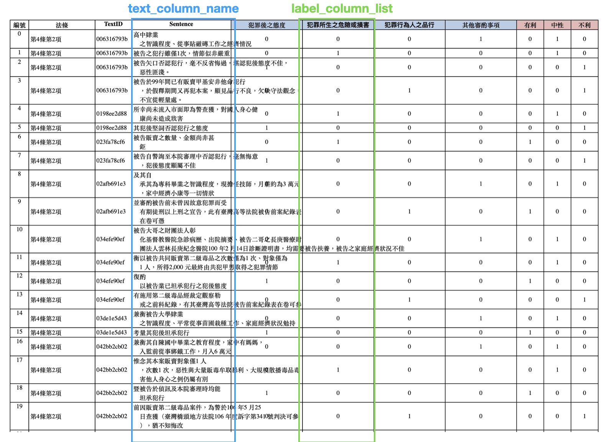
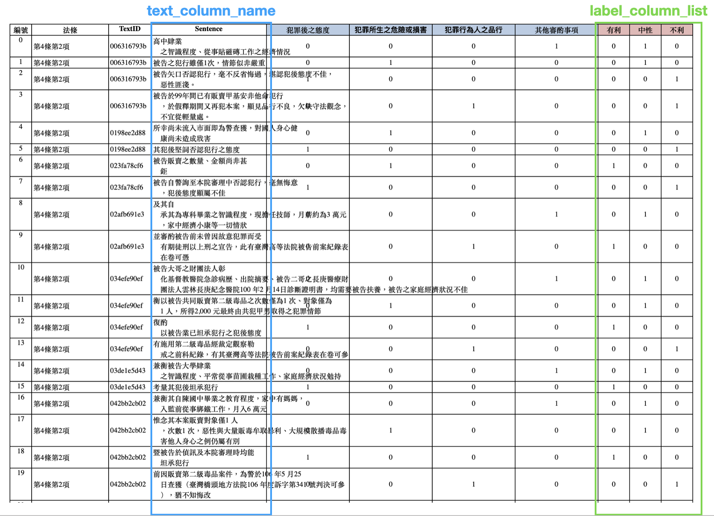

# <center>🦊 LLMForTextClassification 🦊</center>
 🦊 This project provides several types of pre-trained large language model to do text/sequence classification.
 This project can be applied on :
 * **Bibary classification Task(二分類任務)** : label 本身只有正反兩面，例如以AIFR之前參與司法院量刑資訊系統的案子來說，判斷一句話是否有提到「犯罪後之態度」，label 只有「是」(1)與「不是」(0)；或是判斷一句話是「正面」positive(1)或是「負面」negative(0)，不是這個 label 就一定是另外一個 label，也適用此類任務。

 * **Multi-class classification Task(多分類任務)** : label 可能有多種可能，例如在網路自殺危機偵測的案子中，需要判斷一句話是否跟「生理反應」、「自殺行為」、「自殺與憂鬱」、「無助」等多個 label 相關；或是在量行資訊系統中判斷一句話是否為「有利」、「不利」或是「中性」有 3 個 label ，也屬於在 multi-class classification 的範疇。

## Overview
Entry point 是 `main.py` 這份檔案，不管要 train or test，都請執行 `python main.py` 並依照需求在後接上 setting arguments(下面會詳細介紹每個 argument 的用途，也可參考 Quick tour 的範例）。

其餘的主邏輯都放在 `/src` 這個資料夾中，data 多是放在 `./data` 中，原始的輸入資料多是放在 `./data/raw` 中，我們也建議你 follow 這個架構。

在 train 或 test，我們都有寫相對應的 script (如 `./train.sh`, `./test.sh`)，可以在 shell script 中，修改輸入 data 的路徑，或是其他 model setting。並在完成 shell script 的修改後，直接在 terminal 執行 `bash ./train.sh` or `bash ./test.sh`。詳細範例參考下方 Quick Tour 的介紹。

我們強烈推薦使用 `.sh` 來 run 並管理實驗，也方便其他人只要執行同一份 .sh file，就能 reproduce 實驗結果。

## Data Preparation <hr>
請根據以下任務準備符合格式的 **.xlsx** file 當作你的原始輸入資料。
*  **Bibary classification Task(二分類任務)** :

以下以量刑資訊系統的案子為例，只要輸入資料具有兩個 column ：**包含每個句子的 column(Sentence)，以及包含要分類的句子的目標 label 的 column(犯罪所生之危險或損害)即可。**（其餘 column 如編號、法條、textID，這些column都是可有可無）

下圖是以「分類每個句子是否跟犯罪所生之危險或損害有關係」為例的任務資料截圖，輸入資料只需要有藍色和綠色框框中的內容即可。

另外，包含句子內容的 column 名稱可以自訂，不需要跟下圖範例一樣也叫做 Sentence。在執行程式碼時，會從 **--text_column_name** 這個 argument 將你定義的 column 名稱傳進去，default 是 'Sentence'；包含目標 label 的 column 名稱也可自訂，不需要跟下圖範例一樣也叫做「犯罪所生之危害或損害」。在執行程式碼時，會從 **--label_column_list** 這個 argument 將你定義的 label column 名稱傳進去。


 *  **Multi-class classification Task(多分類任務)** :

以下以量刑資訊系統的案子為例，只要輸入資料具有下列 column ：**包含每個句子的 column(Sentence)，以及包含要分類的句子的目標 label 的 columns(有利、中性、不利)即可。**（其餘 column 如編號、法條、textID，這些column都是可有可無）

下圖是以「分類每個句子是否屬於有利、中性或是不利」為例的任務資料截圖，輸入資料只需要有藍色和綠色框框中的內容即可。舉例來說，若該句是有利句，則在「有利」那一欄為 1，其餘「中性」和「不利」都是 0。

另外，包含句子內容的 column 名稱可以自訂，不需要跟下圖範例一樣也叫做 Sentence。在執行程式碼時，會從 **--text_column_name** 這個 argument 將你定義的 column 名稱傳進去，default 是 'Sentence'；包含目標 label 的 column 名稱也可自訂，不需要跟下圖範例一樣也叫做「有利」、「中性」、「不利」。在執行程式碼時，會從 **--label_column_list** 這個 argument 將你定義的 label column 名稱以空白符號為間隔區分傳入，舉例：`--label_column_list 有利 中性 不利` ，程式會以一個 list 的方式記下這些 label 名稱，細節在 Arguments Description 詳述。
 

## Arguments Description
<hr>

1. 模式選擇：

    * `--mode`: train / test

        如果是要訓練模型，請輸入 `--mode train`；如果是要輸入一個測試資料(.xlsx)或是一句 test sentence 讓模型 predict 結果，請輸入 `--mode test`。

2. 讀取資料設定：

    * `--train_data_path`: ./data/raw/data_criminal_drug.xlsx
    
        輸入 training data 的相對路徑，只接受 excel file(.xlsx)。例如放在 `./data/raw` 的 `data_criminal_drug.xlsx`。
    * `--test_data_path`: ./data/pred/data_test_drug.xlsx

        輸入 testinging data 的相對路徑，只接受 excel file(.xlsx)。例如放在 `./data/pred` 的 `data_test_drug.xlsx`。testing data 的檔案格式都和 data preparation 中介紹的一樣，只是 label column 裡面的內容可以留白或是亂填，testing 的時候，會自動把 model 的結果填上去。
    * `--text_column_name`: Sentence

        如 Data Preparation 中所介紹的，請在此填上原始輸入資料中，填放句子的該個column的名稱 name。
    * `--label_column_list`: 有利 中性 不利

        如 Data Preparation 中所介紹的，請在此填上原始輸入資料中，填放 label 的該個 column(Binary classification)或是多個 column 的名稱(multi-class classification)。這個 argument 是一個 list 的型態，如果是 multi-class 有多個 label，則以空白符號分隔，ex: 有利 中性 不利，程式讀入之後，會轉成 list 的形式來儲存 label ，例如:['有利', '中性', '不利']，並以 label 在 list 中的 index 來當作 model 在分類時真正的 label，例如：'有利' 的 label 在製作 dataset 時，會轉變成 0；'中性' 的 label 在製作 dataset 時，會轉變成 1；'不利' 的 label 在製作 dataset 時，會轉變成 2。
    * `--external_data_path`: ./data/raw/data_criminal_drug_neutral.xlsx

        如果有外部資料來擴充某一個 label 的資料量，可以將該外部資料的相對路徑填上，並搭配下面的 `--external_column_idx` 和 `--external_sample_num` 來設定。例如在量刑的案子中，我們有準備額外的中性句子來擴充「中性」這個 label 的句子，就可以在此填入有中性句的 excel file path。
    * `--external_column_idx`: 1

        如果有輸入外部資料的話，需要指定 `external_column_idx` 將該外部資料加入屬於這個 label(external_column_idx)的資料集中。舉例來說，如果 `--label_column_list 有利 中性 不利`，想要將 external data 中的 sentence 加入到 '中性' 這個類別中，以擴增中性的句子，就指定 `--external_column_idx 1` ，因為'中性‘的 label index 為 1，如此 external data 中的 sentence 就會被加入到 '中性' 的句子集中。
    * `--external_sample_num`: 3000

        如果有輸入外部資料的話，可以指定要從中取得多少個 sample 加入到指定的 label 中來擴增該個 label 的 sentence。舉例來說， `--external_sample_num 3000` 並且 `--label_column_list 有利 中性 不利 ` 且 `--external_column_idx 1`代表從 external data 中取得 3000 筆 sentence 加入到 '中性' 的句子集中。
    * `--train_test_split_ratio`: 0.2

        指定切分 train/test 資料集的比例。 train/valid 的比例也一樣套用這個數值。
    * `--test_sample`: 被告犯後坦承犯行、態度尚可

        如果只是想用之前訓練好的 model 測試一個 sample(sentence, paragrapg, document...) 結果的話，可以在 `--test_sample` 後面輸入你的 test case。在 terminal 的最後會 print 出 model 最終預測的結果。

    * `--log_path`: ./log.log

        Training 過程中，我們會自動紀錄 train/valid/test dataset 的長度，以及他們的 label distribution，以及 label name 和 idx 的 mapping；並且會紀錄 model 參數例如 seed, optimizer, batch size, lr, epoch 等，在最終 training 結束，我們會自動跑 evaluate 的 function 來測試 test dataset 的 performance，並自動將測試結果寫入 logging file 中。
        如果這邊沒有指定 log_path 的話，系統會自動創建 logging file 到 `{model_dir}/{model_version}/log_{date}.log` 這個路徑中。同一天跑的實驗，如果 `model_dir`, `model_version` 都一樣的話，都會用 append 的方式寫入到 logging file 中。

3. 模型存儲設定：

    * `--model_dir`: ./ckpt

        Training 結束後，會將 model 儲存到這個資料夾中。如果本來沒有創的話，系統會自動根據 `--model_dir` 輸入的路徑創一個新的。在 training mode 中，這是一個必要輸入。
    * `--model_name`: test

        Training 結束後，會將 model 以這個名稱 `model_name.pkl` 儲存到 `model_dir` 下。在 training mode 中，這是一個必要輸入。
    * `--model_version`: 0.0

        如果實驗有很多版本的話，可以用 `model_version` 這個 argument 區分，沒有就不需要輸入。如果有輸入的話，會在 `model_dir` 下創建一個新的資料夾 `model_version` ，並將訓練好的 model 以 `model_name.pkl` 儲存到其中。
    * `--pretrained_model_name`: bert-base-chinese
        
        不管是 train or test mode，這個都是必要 argument 輸入，預設是 bert-base-chinese。目前支援 bert-based, roberta-based, macbert-based 的 pretrained language model。例如要使用 roberta 的話，可以輸入 `--pretrained_model_name hfl/chinese-roberta-wwm-ext` 或是其他用 roberta-based 訓練的 PM；如果要用 macbert 的話，可以使用 `--pretrained_model_name hfl/chinese-macbert-base`。

    * `--load_model_path`: ./ckpt/version_0.0/test.pkl

        在 Test mode，這個 argument 為必要輸入。需要指定一個之前訓練好的 model 的 saving path，系統會根據這個 path load 相對應的 model 來供後續生成 test data 的predicted result。


4. 模型調參設定：

    * `--device`: cuda

        如果不指定的話，程式會自動判斷現在是否有偵測到可用的 GPU，如果有就用GPU，沒有就用 CPU；如果有特別指定的話，就使用指定的設備。
    * `--seed`: 1234

        該 seed 會用做 data split, data shuffle 和 model weight initialization。
    * `--max_seq_len`: 128
        
        每個 sentence (input x) 的最大長度限制。BERT-based 的 model 最大可接受的長度限制是 512 個 tokens。

    * `--batch_size`: 64

        每個 batch 的 data size。train/valid/test 都使用這個 batch size。

    * `--epoch`: 3

        Training 所需的最大 epoch 數量。

    * `--optimizer`: AdamW

        目前支援 AdamW 和 Adafactor 這兩種 optimizer。

    * `--lr`: 2e-5

        Learning rate。推薦如果是適用 pretrained large lamguage model 的話，可以介於 2e-5 ~ 5e-5 之間。

    * `--scheduler`: linear

        目前支援 linear scheduler 和 adafactor scheduler。       

    * `--pooling_strategy`: reduce_mean

        目前只有 bert-based 的 model 支援 'reduce_mean' 和 'cls' 這兩種 pooling strategy，其餘 model type(roberta, macbert) 只支援 'cls' 這種 pooling strategy。
        'reduce_mean' 就是把 sentence 中每個 token 個 embedding 取平均再送入 classify；'cls' 就是將 [CLS] 這個 token 的 embedding 送到 classify。

## Quick Tour
<hr>

* **Binary Classification Task(二分類任務)**:
1. Train

執行 `bash ./train_binary.sh` 就會看到以量刑資訊系統的毒品資料，來訓練模型分類句子是否屬於「犯罪後之態度」。可以此當成例子，確認在你的環境中，可以正常 run 這個 project。

如果你需要修改參數以符合你的 task 的話，可以創建一個 .sh file，並將下方程式碼按照指示修改成符合你的需求。

* 將 MODEL_DIR, MODEL_NAME, VERSION 改成你希望的。
* 將 TRAIN_DATA_PATH 改成你的原始輸入資料的路徑。
* 將 pretrained_model_name 修改成你預期使用的 model。
* 將 text_column_name 改成在你原始輸入資料中，記錄句子(就是你的input x)的該個 column 的名稱。
* 將 label_column_list 改成在你原始輸入資料中，記錄句子的 label 的 column 名稱們。
* 如果有 external data 就將該路徑填入 EXTERNAL_DATA_PATH，並填上EXTERNAL_COLUMN_IDX，沒有就不要輸入。
* 你也可以在 main.py 後面加入其他 Arguments Description 中介紹的參數，來調整模型。
```
MODEL_DIR=./ckpt
MODEL_NAME=AND
VERSION=0.0

TRAIN_DATA_PATH=./data/raw/data_criminal_drug.xlsx
EXTERNAL_DATA_PATH=./data/raw/data_criminal_drug_neutral.xlsx
EXTERNAL_COLUMN_IDX=0

# Train binary classification
python main.py \
    --mode train \
    --train_data_path $TRAIN_DATA_PATH \
    --external_data_path $EXTERNAL_DATA_PATH \
    --external_column_idx $EXTERNAL_COLUMN_IDX \
    --text_column_name Sentence \
    --label_column_list 犯罪後之態度 \
    --model_dir $MODEL_DIR \
    --model_name $MODEL_NAME \
    --model_version $VERSION
```

2. Test on a **.xlsx** file

執行 `bash ./test_binary.sh` 就會看到以量刑資訊系統的毒品資料，來測試模型分類句子是否屬於「犯罪後之態度」的任務。前提是，你需要有一個已經訓練好的模型。

如果你需要修改參數以符合你的 task 的話，可以創建一個 .sh file，並將下方程式碼按照指示修改成符合你的需求。

如同 train 所介紹的，你需要輸入要 test 的資料路徑(TEST_DATA_PATH)，和一個已經訓練好的 model 的路徑(LOAD_MODEL_PATH)，以及 text_column_name 與 label_column_list。

```
LOAD_MODEL_PATH=./ckpt/version_0.0/AND.pkl
TEST_DATA_PATH=./data/pred/data_test_drug.xlsx
# Test multi-class classification
python main.py \
     --mode test \
     --text_column_name Sentence \
     --label_column_list 犯罪後之態度 \
     --load_model_path $LOAD_MODEL_PATH \
     --test_data_path $TEST_DATA_PATH \
```
3. Test on a **sentence**

有時候，你不需要對整份 excel 的所有test sample(could be a sentence, paragrapg, document) 做測試；你只想試試看某一個句子 model 會預測成哪一個 label。
那你可以創建一個 .sh file，基本上跟上面一樣，只是拿掉 `--test_data_path`，然後再 `-test_sample` 後面接上你要測試的句子就可以了，如下：
```
LOAD_MODEL_PATH=./ckpt/version_0.0/AND.pkl
TEST_DATA_PATH=./data/pred/data_test_drug.xlsx
# Test multi-class classification
python main.py \
     --mode test \
     --text_column_name Sentence \
     --label_column_list 犯罪後之態度 \
     --load_model_path $LOAD_MODEL_PATH \
     --test_sample 被告犯後坦承犯行、態度尚可 \
```

* **Multi-class Classification Task(多分類任務)**:
1. Train

執行 `bash ./train_multiclass.sh` 就會看到以量刑資訊系統的毒品資料，來訓練模型分類句子是屬於有利,不利,中性的任務。可以此當成例子，確認在你的環境中，可以正常 run 這個 project。

如果你需要修改參數以符合你的 task 的話，可以創建一個 .sh file，並將下方程式碼按照指示修改成符合你的需求。

* 將 MODEL_DIR, MODEL_NAME, VERSION 改成你希望的。
* 將 TRAIN_DATA_PATH 改成你的原始輸入資料的路徑。
* 將 pretrained_model_name 修改成你預期使用的 model。
* 將 text_column_name 改成在你原始輸入資料中，記錄句子(就是你的input x)的該個 column 的名稱。
* 將 label_column_list 改成在你原始輸入資料中，記錄句子的 label 的 column 名稱們。
* 如果有 external data 就將該路徑填入 EXTERNAL_DATA_PATH，並填上EXTERNAL_COLUMN_IDX，沒有就不要輸入。
* 你也可以在 main.py 後面加入其他 Arguments Description 中介紹的參數，來調整模型。
```
MODEL_DIR=./ckpt
MODEL_NAME=AND
VERSION=0.0

TRAIN_DATA_PATH=./data/raw/data_criminal_drug.xlsx
EXTERNAL_DATA_PATH=./data/raw/data_criminal_drug_neutral.xlsx
EXTERNAL_COLUMN_IDX=1

# Train mlti-class classification
python main.py \
    --mode train \
    --pretrained_model_name hfl/chinese-macbert-base \
    --max_seq_len 256 \
    --train_data_path $TRAIN_DATA_PATH \
    --text_column_name Sentence \
    --external_column_idx $EXTERNAL_COLUMN_IDX \
    --label_column_list 不利 有利 中性 \
    --model_dir $MODEL_DIR \
    --model_name $MODEL_NAME \
    --model_version $VERSION \
    --external_data_path $EXTERNAL_DATA_PATH \
```
2. Test on a **.xlsx** file

執行 `bash ./test_multiclass.sh` 就會看到以量刑資訊系統的毒品資料，來測試模型分類句子是屬於有利,不利,中性的任務。前提是，你需要有一個已經訓練好分類有利不利中性句子的模型。

如果你需要修改參數以符合你的 task 的話，可以創建一個 .sh file，並將下方程式碼按照指示修改成符合你的需求。

如同 train 所介紹的，你需要輸入要 test 的資料路徑(TEST_DATA_PATH)，和一個已經訓練好的 model 的路徑(LOAD_MODEL_PATH)，以及 text_column_name 與 label_column_list。

```
LOAD_MODEL_PATH=./ckpt/version_0.0/AND.pkl
TEST_DATA_PATH=./data/pred/data_test_drug.xlsx
# Test multi-class classification
python main.py \
     --mode test \
     --text_column_name Sentence \
     --label_column_list 不利 有利 中性 \
     --load_model_path $LOAD_MODEL_PATH \
     --test_data_path $TEST_DATA_PATH \
```
3. Test on a **sentence**

有時候，你不需要對整份 excel 的所有test sample(could be a sentence, paragrapg, document) 做測試；你只想試試看某一個句子 model 會預測成哪一個 label。
那你可以創建一個 .sh file，基本上跟上面一樣，只是拿掉 `--test_data_path`，然後再 `-test_sample` 後面接上你要測試的句子就可以了，如下：
```
LOAD_MODEL_PATH=./ckpt/version_0.0/AND.pkl
TEST_DATA_PATH=./data/pred/data_test_drug.xlsx
# Test multi-class classification
python main.py \
     --mode test \
     --text_column_name Sentence \
     --label_column_list 不利 有利 中性 \
     --load_model_path $LOAD_MODEL_PATH \
     --test_sample 被告犯後坦承犯行、態度尚可 \
```